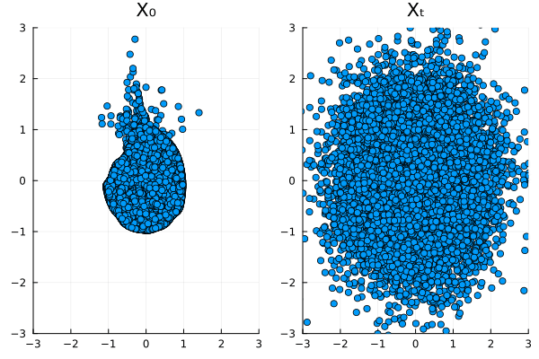
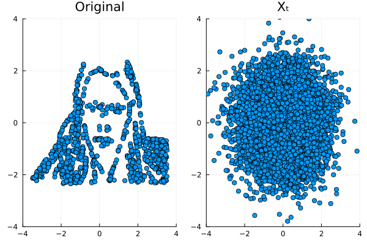

# DenoisingDiffusionFun.jl
This is an attempt to explore and reproduce a minimal example of Lior Sinai's brilliant tutorial on [Denoising Diffusion probabilistic models from first principles](https://liorsinai.github.io/coding/2022/12/03/denoising-diffusion-1-spiral.html). 

